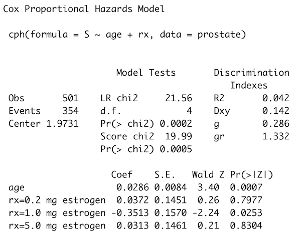
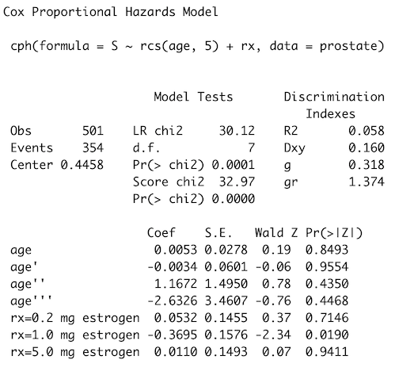

```{r include=FALSE}
library(survival)
library(survminer)
library(dplyr)
library(stringr)
library(rms)
```


## Overview

- Statistics review
- Why survival analysis
- Censoring and Kaplan Meier
- Cox Proportional Hazards
- Sample Size
- Missing Data
- How to interpret statistics

## Hypothesis Testing Evaluates Evidence

Procedure:

1. Determine null hypothesis $H_0$
2. Choose effect size $\beta$ of interest
3. Pick alternative hypothesis $H_1$
4. Compute p-value
5. Analyze evidence

Don't dichotomize p-value!


## Does Treatment Affect Survival?

- $H_0: \beta = 0$ Drug doesn't affect survival
- $H_1: \beta \neq 0$ Drug affects survival

```{r echo=FALSE}
data(ovarian)
ovarian <- ovarian %>%
  mutate(treatment = case_when(rx == 1 ~ "Placebo", 
                               rx == 2 ~ "Drug")) %>%
  mutate(treatment = relevel(factor(treatment), ref = "Placebo"))
ovarian.survfit <- survfit(Surv(futime, fustat) ~ treatment, data = ovarian)
ggsurvplot(ovarian.survfit, data = ovarian, pval = T)
```

## Hypothesis Tests Can Make Mistakes

- False Positive: Reject $H_0$ when $H_0$ is true
- False Negative: Accept $H_0$ when $H_1$ is true


## Power Tells Us About Type II Errors

- Probability of finding a false negative
- $90%$ power is standard for preclinical experiments
- Clinical trials often want $\geq 90\%$ power
- Cohort studies often won't analyze until enough patients collected

## Confounding Creates Spurious Assocations

- Association between two variables explained by a third variable
- Ice cream sales correlated with increased drownings?
- Beware of lurking confounders like temperature!


## Confounding Deceives Us

```{r echo=FALSE}
data("iris")
iris %>%
  ggplot(aes(Petal.Width, Sepal.Width)) +
  geom_point() +
  geom_smooth(method = "lm") +
  ggtitle("Sepal width decreases as petal width increase")
```

## Confounding Deceives Us

```{r echo=FALSE}
data("iris")
iris %>%
  ggplot(aes(Petal.Width, Sepal.Width)) +
  geom_point(aes(color = Species)) +
  geom_smooth(aes(color = Species), method = "lm")
```


## Experimental Design Is Critical

- Observational studies collect data without intervening
- Cohort and case control studies are observational
- Observational studies need to adjust for confounding
- Randomized experiments randomly assign patients to groups
- Phase II/III clinical trials are randomized (RCTs)
- Randomization blocks confounding

## Statistical Goals Affect Analysis

- Estimation focuses on estimating $\beta$'s
- Effects estimation used in clinical trials
- Prediction tries to make guesses about future events
- Prediction modeling used for biomarker development and risk prediction

## Time to Event Analysis

- Record time until event (death, heart attack)
- Record status (1 = event, 0 = censored)
- Using time instead of just status increases power


## Kaplan Meier Estimates Survival

- Estimate survival function $S(t)$
- Tells us probability of event occuring at time $t$
- $S_{KM}(t) = \Pi_{i:t_i \leq t} (1 - \frac{d_i}{n_i})$
- $d_i$ = # failures and $n_i$ = # patients at risk at $t$
- Great for summary statistics - meh for inference

## Kaplan Meier Estimates Survival

```{r echo=TRUE, warning=TRUE}
overall.survival <- survfit(Surv(futime, fustat) ~ 1, data = ovarian)
ggsurvplot(overall.survival, conf.int = T)
```


## Log rank tests survival difference

```{r include=FALSE}
attach(aml)
```

```{r}
aml.logrank <- survfit(Surv(aml$time, aml$status) ~ x, data = aml)
ggsurvplot(aml.logrank, pval = T)
```

## Kaplan Meier has limitations

- What if we need to adjust for confounders?
- What if we have a continuous variable?
- Where do we dichotomize?

## Dichotomization is the root of all evil

- Dichotomization discards $80\%$ of info losing power
- Cutpoints are arbitrary
- No real reason to choose median
- Cutpoints often don't reproduce
- ADD THAT SLIDE FROM TWITTER WITH ALL THE PAPERS AGAINST DICHOTIMIZATION

## Iterative Kaplan Meier isn't efficient

- Repeated testing greatly inflates Type I error
- MCMC simulation needed to correct p-values
- Dichotomization requires many more patients to see effect
- No literature on the procedure
- ADD DICHOTOMOUS KAPLAN MEIER WITH X

## Cox Proportional Hazards Model

- Semi-parametric regression model
- Can include multiple variables
- Adjust for confounding
- Model nonlinear effects with splines

## Cox PH Interpretation


```{r include=FALSE}
getHdata(prostate)
prostate <- prostate %>%
  mutate(status = case_when(
    str_detect(status, "alive") ~ 0,
    str_detect(status, "dead") ~ 1
  ))
ddist <- datadist(prostate)
options(datadist = "ddist")
S <- Surv(prostate$dtime, prostate$status)
```


```{r echo=TRUE, collapse=TRUE}
model <- cph(S ~ age + rx, data = prostate)
```



## Modeling Nonlinear Effects

```{r}
nonlinear.fit <- cph(S ~ rcs(age, 5) + rx, data = prostate)
```



## Interpretting Nonlinear Effects

```{r}
anova(nonlinear.fit)
```

## Interpretting Nonlinear Effects

```{r echo=FALSE}
ggplot(Predict(nonlinear.fit, age, fun = exp)) + 
  ggtitle("Effect of Age on Survival") +
  labs(x = "Age (Years)", y = "Hazard Ratio")
```

## Treatment Heterogeneity

- Treatment effects can vary among individuals
- Use Wang and Ware paper

## Verifying Proportional Hazards

- PH assumes hazard ratio constant over time


## Don't Cross Curves!


- Proportional hazards assumption can come back to haunt you!

## Don't Cross Curves!

- Crossing curves show PH violation


## cox.zph Tests for PH Violation

```{r include=FALSE}
ph.fit <- cph(S ~ rcs(age, 5) + rx, data = prostate, x=T, y=T)
```

- p-values $\geq$ .05 suggest PH isn't violated

```{r}
cox.zph(ph.fit)
```

## How To Fix PH Violations

- Try splines for continuous variables
- Don't care about effect then stratify
- Use time $\times$ rx interaction to make effect time dependent
- Switch to AFT models

```{r echo=TRUE}
f <- cph(S ~ rcs(age, 5) + strat(rx), data = prostate)
```

## Sample Size is Everything!

- Sample size affects power
- More samples means more precision to detect smaller effects
- $n$ = number of events NOT patients
- Kaplan Meier needs $n=184$ patients for $\pm .1$ error margins
- Adding covariates requires $n >> 184$
- (Bad) rule of thumb: 15 events per variable (EPV) 
- In reality EPV much more complicated
- Subgroup heterogeneity harder to detect
- Often need $\geq 4n$ samples

## Basement Power Calculations

- Use calculator and show some example powers

## What Variables to Include

- Available sample size limits number of variables to include
- Variable selection significantly impacts inference
- Estimation worried about confounding
- Prediction worried about overfitting

## Univariate Feature Selection is Bad!

- Common to build univariate models for each feature first
- Build combined model with only significant univariate features
- Specific type of stepwise regression
- FIND EXAMPLE OF UNIVARIATE REGRESSION TABLE

## Stepwise Selection Wrecks Inference

- Univariate selection can be highly variable
- Doesn't adjust for confounding
- P-values and CIs for the combined model will be invalid
- Lacking sound statistical theory

## How to Choose Features

- Proper selection strategies:  
    1. Domain expert specifies relevant variables
    2. Add all variables and use shrinkage
    3. Data reduction blinded to response
- These approaches prevent overfitting
- Leave insignificant variables in the model
- Include possible confounders


## Don't Discard Patients with Missing Data

- Missing data can significantly decrease sample size
- Goal is to maximize sample size for max power
- Ask why is this data missing?
- Missing values can indicate selection bias
- Missing lab values b/c died before surgery could happen
- Look for missing data patterns
- Clustering finds variables that are missing together

## Clustering Missing Data

- Include code example and naclus plot

## Imputation Gives Us The Power

- Data missing at random (MAR) can be imputed
- Features with missing data will already have more uncertain estimates
- Better to guess values than discard all info from patient
- MICE imputation maintains statistical validity
- FIND A DATASET AND SHOW CODE

## Imputation Recommendations

- $< 3\%$ missing: median imputation or casewise deletion
- $\geq 3\%$ missing: MICE with max(5, 100x) imputations
- Many predictors frequently missing: sensitivity analysis with more imputations

## Evaluating Biomarkers

## Interpretting Statistical Results